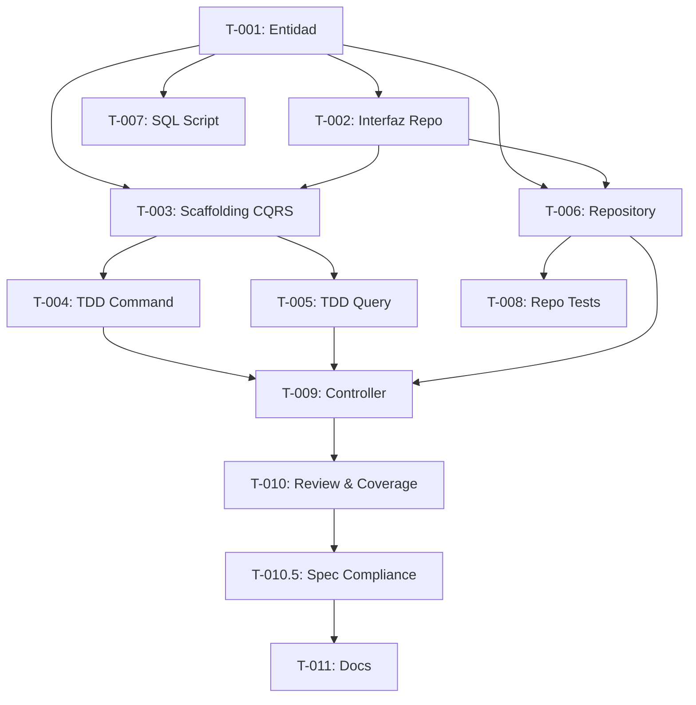

# Tareas de Implementación: [Título del Feature]

## Resumen

| Campo | Valor |
|-------|-------|
| Work Item | [ID] |
| Total de tareas | [N] |
| Tiempo estimado | [N horas] |
| Enfoque | TDD Iterativo (ciclo Red→Green→Refactor) |

**Documentos de referencia:**
- Spec: `specs/active/{ID}-{feature-name}/specification.md`
- Plan: `specs/active/{ID}-{feature-name}/plan.md`

## Definition of Done

Una tarea está **completada** cuando:
- [ ] El código compila sin errores (`dotnet build`).
- [ ] Los tests de la tarea pasan (`dotnet test`).
- [ ] El código sigue las convenciones de la capa (ver `.github/instructions/`).
- [ ] No hay código muerto ni TODOs sin resolver.
- [ ] El checkpoint de la fase correspondiente está verde.

## Convenciones de Estado

| Símbolo | Significado |
|---------|-------------|
| ⬜ | pendiente |
| 🔄 | en progreso |
| ✅ | completada |
| 🚫 | bloqueada (indicar motivo) |

**Complejidad:** S — Simple (< 30 min) · M — Media (30–60 min) · L — Compleja (> 60 min)

## Contexto Técnico Acumulado

> Fuente única de verdad para el Orchestrator y sus sub-agentes. Copiado del plan (que incluye lo heredado de la spec). Los agentes NO consultan spec ni plan — solo esta sección.

### Heredado del Plan

#### Domain
[Copiar íntegramente "Domain" de la sección "Contexto Técnico Acumulado" del plan]

#### Application
[Copiar íntegramente "Application" del plan]

#### Infrastructure
[Copiar íntegramente "Infrastructure" del plan]

#### Api
[Copiar íntegramente "Api" del plan]

#### Tests
[Copiar íntegramente "Tests" del plan]

#### Hallazgos Adicionales del Plan Builder
[Copiar íntegramente "Hallazgos Adicionales" del plan — DI, decorators, referencias de test, estado del codebase]

### Verificación del Task Definer

> Resultado de la verificación de existencia de archivos y detección de conflictos por el Task Definer.

| Archivo | Estado | Acción |
|---------|--------|--------|
| `src/Olimpia.Domain/Entities/[Nombre].cs` | No existe | Crear |
| `src/Olimpia.Domain/Repositories/I[Nombre]Repository.cs` | No existe | Crear |
| `src/Olimpia.Infrastructure/Persistence/Repositories/[Nombre]Repository.cs` | No existe | Crear |

**Conflictos detectados:** [Ninguno / Descripción de conflictos]

**Estado de DI:** [Auto-registro verificado en `DependencyInjection.cs` — no requiere registro manual / Requiere registro manual en: [archivo]]

## Fase 1: Domain

### T-001 · S · Crear entidad [Nombre]

- **Capa:** Domain
- **Archivo:** `src/Olimpia.Domain/Entities/[Nombre].cs`
- **Agente:** Domain Implementer
- **Referencia:** `src/Olimpia.Domain/Entities/Product.cs`
- **Descripción:** Crear entidad `sealed` que hereda de `BaseEntity` con las propiedades definidas en la spec (§9 Modelo de Datos).
- **Criterio de completitud:** La clase compila. Todas las propiedades del modelo de datos tienen el tipo y restricciones correctas.
- **Dependencias:** Ninguna.
- **Estado:** ⬜ pendiente

### T-002 · S · Crear interfaz I[Nombre]Repository

- **Capa:** Domain
- **Archivo:** `src/Olimpia.Domain/Repositories/I[Nombre]Repository.cs`
- **Agente:** Domain Implementer
- **Referencia:** `src/Olimpia.Domain/Repositories/IProductRepository.cs`
- **Descripción:** Interfaz que extiende `IGenericRepository<[Nombre]>` con métodos específicos del dominio definidos en la spec.
- **Criterio de completitud:** La interfaz compila y declara exactamente los métodos necesarios para los requisitos funcionales.
- **Dependencias:** T-001.
- **Estado:** ⬜ pendiente

**✅ Checkpoint Fase 1:** `dotnet build src/Olimpia.Domain`

## Fase 2: Application Scaffolding

### T-003 · S · Crear scaffolding CQRS para [Feature]

- **Capa:** Application
- **Archivos:**
  - `src/Olimpia.Application/[Feature]/Commands/[Action][Feature]/[Action][Feature]Command.cs`
  - `src/Olimpia.Application/[Feature]/Queries/[Action][Feature]/[Action][Feature]Query.cs`
  - `src/Olimpia.Application/[Feature]/Queries/[Action][Feature]/[Action][Feature]Dto.cs`
- **Agente:** Application Implementer
- **Descripción:** Crear los records declarativos (Command, Query, DTO). SIN implementar Handlers ni Validators — eso lo hace el TDD Implementer en Fase 3.
- **Criterio de completitud:** Los records compilan. Command implementa `ICommand<T>`, Query implementa `IQuery<T>`, Dto es `sealed record`.
- **Dependencias:** T-001, T-002.
- **Estado:** ⬜ pendiente

**✅ Checkpoint Fase 2:** `dotnet build src/Olimpia.Application`

## Fase 3: TDD — Handlers, Validators y Tests

### T-004 · L · Ciclo TDD: [Action][Feature] Command Handler

- **Capa:** Application + Tests
- **Archivos:**
  - `tests/Olimpia.Tests/Handlers/[Feature]/[Action][Feature]HandlerTests.cs` (RED primero)
  - `src/Olimpia.Application/[Feature]/Commands/[Action][Feature]/[Action][Feature]Handler.cs` (GREEN)
  - `src/Olimpia.Application/[Feature]/Commands/[Action][Feature]/[Action][Feature]Validator.cs` (GREEN)
- **Agente:** TDD Implementer
- **Referencia:** `src/Olimpia.Application/Products/Commands/CreateProduct/`
- **Descripción:**
  1. RED: Escribir tests que definan el comportamiento del handler y validator según los criterios de aceptación (spec §7) y reglas de negocio (spec §11).
  2. GREEN: Implementar el Handler mínimo y el Validator para que los tests pasen.
  3. REFACTOR: Limpiar sin cambiar comportamiento.
- **Criterio de completitud:** `dotnet test` — todos los tests de esta tarea PASAN. Handler maneja transacción con rollback en error. Validator cubre todos los campos de spec §12.
- **Dependencias:** T-003.
- **Estado:** ⬜ pendiente

### T-005 · M · Ciclo TDD: [Action][Feature] Query Handler

- **Capa:** Application + Tests
- **Archivos:**
  - `tests/Olimpia.Tests/Handlers/[Feature]/[Action][Feature]HandlerTests.cs` (RED primero)
  - `src/Olimpia.Application/[Feature]/Queries/[Action][Feature]/[Action][Feature]Handler.cs` (GREEN)
- **Agente:** TDD Implementer
- **Referencia:** `src/Olimpia.Application/Products/Queries/GetProduct/`
- **Descripción:** Ciclo Red→Green→Refactor para el query handler. El handler retorna el DTO mapeado desde la entidad. Lanza `KeyNotFoundException` si el recurso no existe.
- **Criterio de completitud:** Tests pasan. Query retorna DTO correcto. Lanza excepción tipada cuando no hay resultado.
- **Dependencias:** T-003.
- **Estado:** ⬜ pendiente

**✅ Checkpoint Fase 3:** `dotnet test` — todos los tests pasan (Green).

## Fase 4: Infrastructure + Database

### T-006 · M · Crear [Nombre]Repository

- **Capa:** Infrastructure
- **Archivo:** `src/Olimpia.Infrastructure/Persistence/Repositories/[Nombre]Repository.cs`
- **Agente:** Infrastructure Implementer
- **Referencia:** `src/Olimpia.Infrastructure/Persistence/Repositories/ProductRepository.cs`
- **Descripción:** Repositorio `sealed` que hereda de `GenericRepository<[Nombre]>` e implementa `I[Nombre]Repository`. Agregar métodos custom que no provee el genérico. El DI es automático vía Scrutor.
- **Criterio de completitud:** Compila. Implementa todos los métodos de `I[Nombre]Repository`. Override de `TableName` si el nombre de tabla no sigue la convención `{Entidad}s`.
- **Dependencias:** T-001, T-002.
- **Paralelo con:** Fase 3.
- **Estado:** ⬜ pendiente

### T-007 · M · Crear script SQL tabla [Nombre]s

- **Capa:** Database
- **Archivo:** `scripts/[Nombre]s.sql`
- **Agente:** SQL Server Implementer
- **Descripción:** Script idempotente (`IF NOT EXISTS`) para SQL Server. Incluye: `CREATE TABLE`, índices (PK, FK, índices de búsqueda), documentación con `sp_addextendedproperty` para tabla y columnas.
- **Criterio de completitud:** Script ejecutable en SQL Server sin errores. Columnas coinciden con propiedades de la entidad Domain (T-001). Tabla y columnas documentadas.
- **Dependencias:** T-001.
- **Paralelo con:** T-006.
- **Estado:** ⬜ pendiente

### T-008 · M · Tests unitarios de [Nombre]Repository

- **Capa:** Tests
- **Archivo:** `tests/Olimpia.Tests/Repositories/[Nombre]RepositoryTests.cs`
- **Agente:** TDD Implementer
- **Descripción:** Tests unitarios del repositorio con mocks de `IDbConnection` o SqlKata. Verificar que los métodos custom ejecutan las queries correctas.
- **Criterio de completitud:** Tests pasan. Cobertura de los métodos custom del repositorio.
- **Dependencias:** T-006.
- **Estado:** ⬜ pendiente

**✅ Checkpoint Fase 4:** `dotnet build src/Olimpia.Infrastructure` + `dotnet test`

## Fase 5: Api

### T-009 · M · Crear [Feature]Controller

- **Capa:** Api
- **Archivo:** `src/Olimpia.Api/Controllers/V1/[Feature]Controller.cs`
- **Agente:** API Implementer
- **Referencia:** `src/Olimpia.Api/Controllers/V1/ProductController.cs`
- **Descripción:** Controller `sealed` que hereda de `ApiController`. Atributo `[ApiVersion("1.0")]` en la clase y `[MapToApiVersion("1.0")]` en cada método. Usa `IMediator` para despachar Commands y Queries. Scopes definidos en spec §13. NO tiene lógica de negocio — solo recibe, despacha y retorna.
- **Criterio de completitud:** Compila. Todos los endpoints de spec §10 están expuestos. Auth correcta por endpoint según spec §13.
- **Dependencias:** T-004, T-005, T-006.
- **Estado:** ⬜ pendiente

**✅ Checkpoint Fase 5:** `dotnet build` (solución completa) + `dotnet test`

## Fase 6: Code Review y Cobertura

### T-010 · M · Revisión de calidad y cobertura ≥95%

- **Agentes:** Code Reviewer → Coverage Analyzer → TDD Implementer (si cobertura < 95%)
- **Descripción:**
  1. Code Reviewer analiza todos los archivos nuevos/modificados.
  2. Corregir todos los issues críticos con el sub-agente correspondiente.
  3. Coverage Analyzer ejecuta `dotnet test --collect:"XPlat Code Coverage"`.
  4. Si cobertura < 95%, TDD Implementer agrega tests para los métodos sin cubrir.
  5. Repetir hasta ≥95% o máximo 3 iteraciones.
- **Criterio de completitud:** Veredicto Code Reviewer: APROBADO. Cobertura ≥95% en archivos nuevos.
- **Dependencias:** T-009.
- **Estado:** ⬜ pendiente

**✅ Checkpoint Fase 6:** Cobertura ≥95% + revisión aprobada.

## Fase 6.5: Verificación de Cumplimiento de Spec

### T-010.5 · M · Verificar alineación spec↔código

- **Agente:** Spec Compliance Verifier
- **Descripción:**
  1. Spec Compliance Verifier lee la especificación original y cross-referencia contra el código implementado.
  2. Verifica cada RF, CA, RN, validación, endpoint, modelo de datos y autorización.
  3. Detecta gold-plating (funcionalidad no especificada).
  4. Si veredicto NO CUMPLE, el Orchestrator delega correcciones al sub-agente de la capa afectada (máx 2 iteraciones).
  5. Guarda reporte en `specs/active/{ID}-{feature-name}/compliance-report.md`.
- **Criterio de completitud:** Veredicto CUMPLE o CUMPLE CON ADVERTENCIAS.
- **Dependencias:** T-010.
- **Estado:** ⬜ pendiente

**✅ Checkpoint Fase 6.5:** Veredicto CUMPLE o CUMPLE CON ADVERTENCIAS.

## Fase 7: Documentación

### T-011 · S · Actualizar documentación

- **Agente:** Doc Updater
- **Descripción:** Verificar si README.md, docs/API.md u otros documentos necesitan actualización por los nuevos endpoints o cambios arquitectónicos.
- **Criterio de completitud:** Doc Updater reporta ACTUALIZADO o SIN CAMBIOS NECESARIOS.
- **Dependencias:** T-010.
- **Estado:** ⬜ pendiente

**✅ Checkpoint Final:** Build + Tests + Cobertura ≥95% + Spec Compliance CUMPLE + Docs actualizados.

## Grafo de Dependencias

## Tabla de Ejecución

| Fase | Tareas | Agente principal | Paralelo con | Checkpoint |
|------|--------|-----------------|-------------|------------|
| 1. Domain | T-001, T-002 | Domain Implementer | — | `dotnet build Domain` |
| 2. App Scaffolding | T-003 | Application Implementer | — | `dotnet build Application` |
| 3. TDD | T-004, T-005 | TDD Implementer | Fase 4 | `dotnet test` |
| 4. Infra + DB | T-006, T-007, T-008 | Infrastructure + SQL + TDD | Fase 3 | `dotnet build Infrastructure` |
| 5. Api | T-009 | API Implementer | — | `dotnet build` + `dotnet test` |
| 6. Review & Coverage | T-010 | Code Reviewer + Coverage | — | Cobertura ≥95% |
| 6.5. Spec Compliance | T-010.5 | Spec Compliance Verifier | — | Veredicto CUMPLE |
| 7. Documentación | T-011 | Doc Updater | — | Revisión manual |

## Registro de Cambios

| Fecha | Versión | Cambio | Autor |
|-------|---------|--------|-------|
| [YYYY-MM-DD] | 1.0 | Creación inicial | [Agente / Developer] |

## Aprobación

- [ ] **Developer:** [Nombre] — Fecha: [YYYY-MM-DD]
